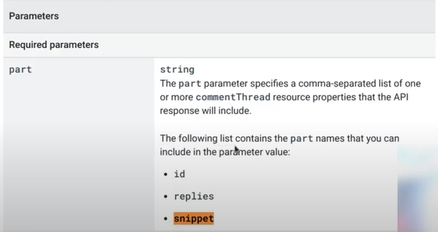
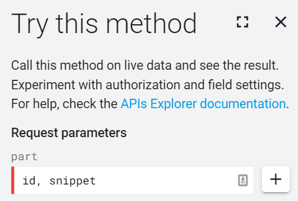
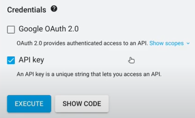

# day4_youtube_comments_to_csv

- [YouTube Comments to CSV (✓ Official YouTube API, ✘ scraping) w Python](https://www.youtube.com/watch?v=XTjtPc0uiG8)
- https://developers.google.com/youtube/v3/docs/commentThreads/list

We don't need Google OAuth 2.0, so we can uncheck this

