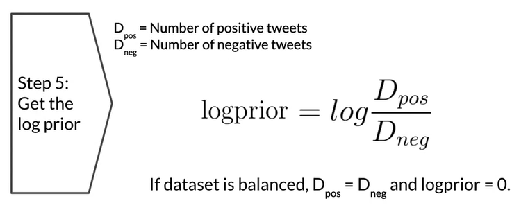

## Sentiment Analysis with Naive Bayes

https://www.coursera.org/learn/classification-vector-spaces-in-nlp/home/week/2

## Probability and Bayes' Rule

## Naive Bayes Intro

- It's called 'Naive' because this method makes the assumption that the features that you're using for classification are indendepent. But in reality, rarely the case
- 
  - 
  - Power word
    
  - Example case
    

## Training Naive Bayes

- 
- 
- 
- 
- Summary
  

## Testing Naive Bayes

- Predict using Naive Bayes
  
- Summary
  

## Application of Naive Bayes

## Error Analysis

- Punctuation
  
- Removing Words
  
- Word order
  
- Adversarial Attack
  

## Conclusion

- 

