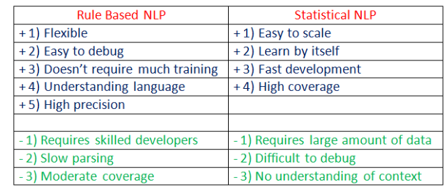
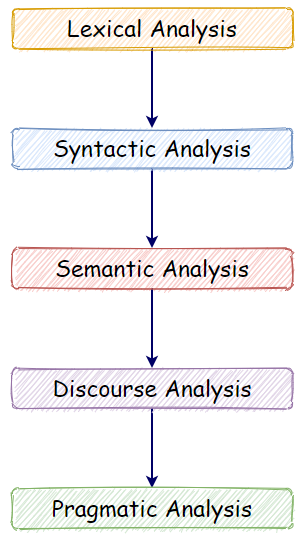

# Day 6 - NLP With Python

https://towardsai.net/p/nlp/natural-language-processing-nlp-with-python-tutorial-for-beginners-1f54e610a1a0

## Application of NLP

- Machine Translation.
- Speech Recognition.
- [Sentiment Analysis](https://towardsai.net/p/nlp/sentiment-analysis-opinion-mining-with-python-nlp-tutorial-d1f173ca4e3c).
- Question Answering.
- Summarization of Text.
- Chatbot.
- Intelligent Systems.
- Text Classifications.
- Character Recognition.
- Spell Checking.
- Spam Detection.
- Autocomplete.
- Named Entity Recognition.
- Predictive Typing.

## Rule-based vs Statistical NLP

### Rule Based

For example:

- the freezing temperature can lead to death,
- hot coffee can burn people’s skin, 
- along with other common sense reasoning tasks

However, this process can take much time, and it requires manual effort.

### Statistical

- Utilize big data, ML algorithm to train NLP models

### Comparison

## Component of NLP

### Lexical Analysis

- divide a whole chunk of text into paragraphs, sentences, and words
- involves identifying and analyzing words' structure

### Syntactic Analysis

- Analysis of words in a sentence for grammar and arranging words in a manner that shows the relationship among the words
- Example of wrong syntactic sentences: "The shop goes to the house"

### Semantic Analysis

- Draws exact meaning for the words, and it analyzes the text meaningfulness
- Example of wrong semantic sentences: "hot-ice-cream"

### Disclosure Integration

- Takes into account the context of the text
- It considers the meaning of the sentence before it ends

### Pragmatic Analysis

- Deals with overall communication and interpretation of language
- Deals with deriving meaningful use of language in various situation

## Current Challenge in NLP

1. Breaking sentences into tokens.
2. Tagging parts of speech (POS).
3. Building an appropriate vocabulary.
4. Linking the components of a created vocabulary.
5. Understanding the context.
6. Extracting semantic meaning.
7. Named Entity Recognition (NER).
8. Transforming unstructured data into structured data.
9. Ambiguity in speech.

## Easy to Use NLP Libraries

- NLTK
- spaCy
- Gensim
- Pattern
- TextBlob

## TF-IDF

- stands for **Term Frequency — Inverse Document Frequency**
- scoring measure generally used in information retrieval (IR) and summarization
- TF-IDF score shows how important or relevant a term is in a given document

- 