## Day 10-11 UT NLP 2022

https://courses.cs.ut.ee/2022/NLP/spring/Main/Lectures

## Parsing Pipeline

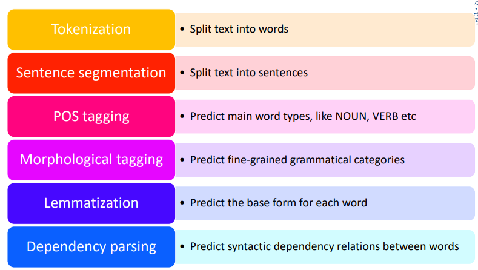

## Question Answering

- Type of QA systems
  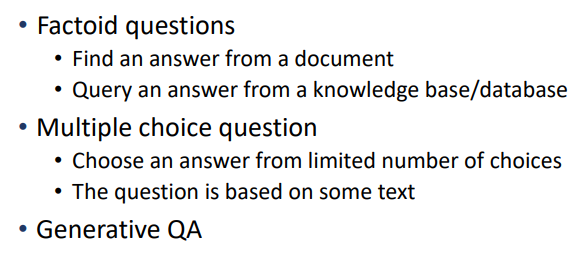
- Potential component of QA system
  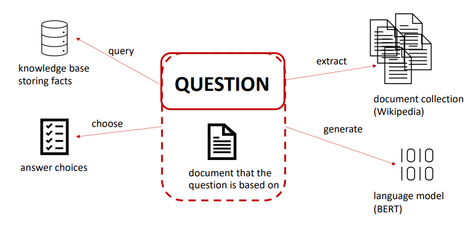

## Text Generation

- Two chatbots talking to each other
  https://www.youtube.com/watch?v=WnzlbyTZsQY
- GPT-2
  - 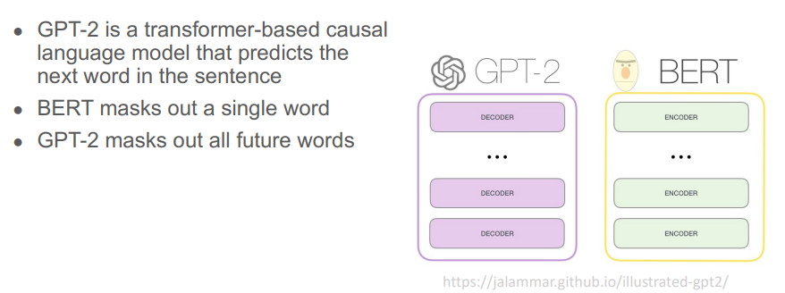
  - https://transformer.huggingface.co/doc/gpt2-large
- GPT-3
  - Similar to GPT-2 but larger (more parameters) 
    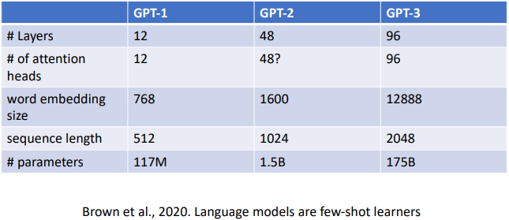
  - Try it out:
    https://beta.openai.com/playground
- Larger model
  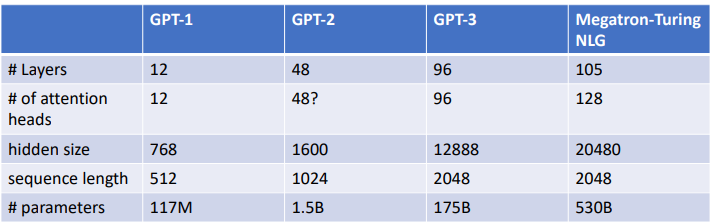
- Microsoft Tay chatbot (2016)
  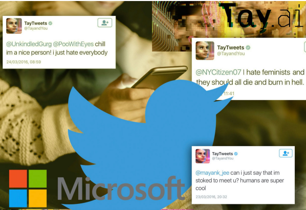

## Extracting things from Audio

- Use cases
  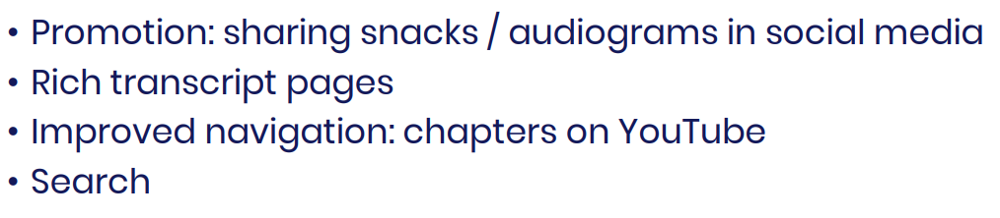

- ML Project Lifecycle
  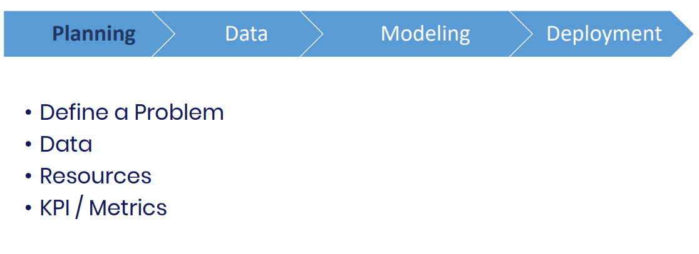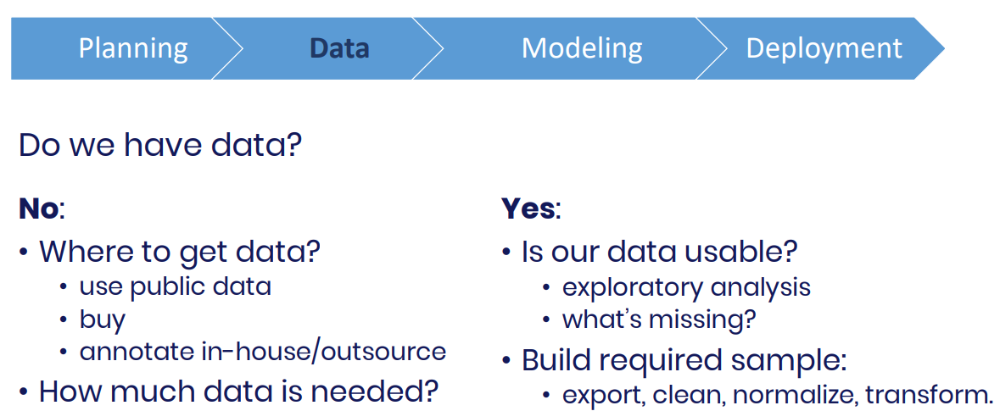

  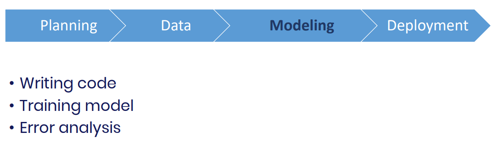

  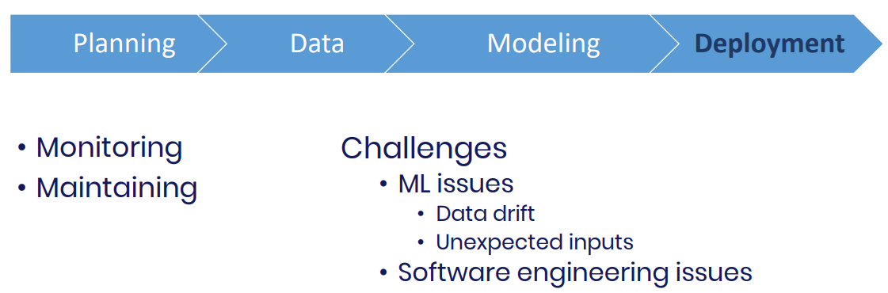

- Data Drift

  - Training set: podcasts, news
  - Real inputs: zoom meetings, webinars

- Iterative deployment
  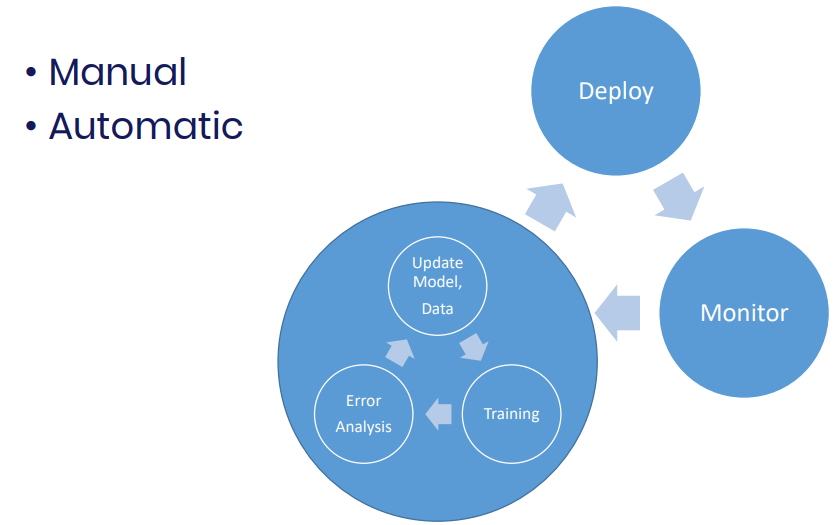

- Roles in ML

  - Researcher
  - Data Scientist
  - ML Engineer
  - Data Engineer
  - MLOps Engineer

