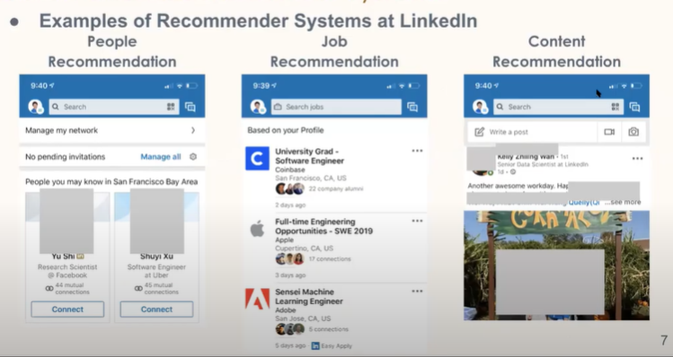

# LinkedIn DeText: A Deep NLP Framework for Intelligent Text Understanding

https://youtu.be/yXxGOcVomGM?list=PLk9rX6zZMSNGpXODGlN6jwYMV70K-5O5n

https://github.com/linkedin/detext

## Search and Recommender Systems

Example

LinkedIn Search and Recommendation Ecosystem

## Deep Learning for NLP

- NLP in Search and Recommender Systems
  
-  Large amounts of text data
  
- Understanding Text Semantics
  
  - Software engineer = programmer ?
- Benefits of Deep NLP
  
- Challenge of Designing a Deep NLP Framework
  

## DeText Framework

- Goals
  
- DeText Framework Design
  
  

## Applications: Ranking

- Search systems at LinkedIn
  
- Ranking for Search Systems: An Example
  
  - Experiments
    
  - Online Deployment
    
- Two-Pass Ranking: Solution to Large # of Documents
  
- LiBERT - BERT Serving Solution 1
  
  - Latency Performance
    
  - Relevance Performance
    
- Embedding Precomputation - BERT Serving Solution 2
  
  - Offline Latency Test
    
  - Online Deployment Summary
    
- Classification Applications at LinkedIn
  
  - Example: Query Intent Classification
    
  - Results
    

## Conclusions

## References

