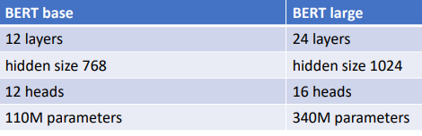

# Day 8/9 - UT NLP 2021

https://courses.cs.ut.ee/2021/NLP/spring/Main/Lectures

## Introduction to NLP

- 
- Brief History
  
- Text corpora and NLP datasets
  - text corpus = collection of texts
  - text corpus + annotation or labels = dataset
    - annotation can be: categories, named entities, sentiment, translation, summary, answer to question
- Stemming and Lematization
  
- Preprocessing
  - goal -> transforming the text into a format that can be fed into an NLP system
  - can be:
    - Segmentation, tokenization
    - Lowercasing the text
    - Stemming / Lematization
    - Remove stopwords
    - Normalization
    - Noise Removal: punctuation, special characters, urls, hashtags etc
  - Is it necessary?
    - It depends ..
    - Neural models need less preprocessing than statistical models (like SVM)
    - Stop-word removal is not a good idea if the word ordering is important in the model

## Language Modeling

- Two main purposes:
  - Estimate the grammaticality or fluency of a sentence or text in order to pick one of several possible options
  - Generate fluent and grammatical sentence or text
- N-gram language model
  
- Software for language modelling
  - KenLM: https://github.com/kpu/kenlm 
  - SRILM: http://www.speech.sri.com/projects/srilm/

## Text Classification

- Classification vs Regression
  

- Text representation for classification

  - TF-IDF

    - Tf-idf = tf (term frequency) x idf (inverse document frequency)
    - Example:
      
    - Pre-processing:
      - Tokenization
      - Stemming/Lemmatization
      - Remove stop words
      - Remove infrequent words
      - Replace certain word tokens with special entities
      - Replace all numeric tokens with NUM
      - Lowercase the text
      - Social media - handle emoticons

  - BOW (Bag of Words)

    - Variation
      word n-grams
      

      character n-grams
      

- How to represent a document?
  

- Default baselines for text classification

  - Logistic regression or SVM for binary classification
  - Logistic regression for multiclass classification
  - Fasttext classification model
  - When the dataset is small, it also makes sense to try Naive Bayes
  - Logistic regression, SVM and Naive Bayes are available in sklearn

- Evaluating Measure

  - Accuracy: not suitable when the classes are unbalanced
  - Precision: also called positive predictive value
  - Recall: also called true positive rate or sensitivity
  - F1-score: combines precision and recall

- Micro- and macro-averaging
  

## Convolutional neural networks

- Feature Extraction in Image
  
- 
- Convolutional layer for text
  - With different filters
    

## Sequence Tagging

- POS Tagging
  - Part-of-speech tags, syntactic categories, word classes
  - POS tags give information about the word and its neighbors
  - Useful for many other NLP tasks: information extraction, syntactic parsing, information retrieval, summarization
  - Example:
    
- Named Entity Recognition
  - Find all **named entities** in the text and label their types
    
  - Type of named entities
    

## Contextual word embeddings

- ELMo – Embeddings from Language Models
  - Task-specific combination of the language model layer representations
  - For each token, there are 2*L+1 representations in a L-layer language model
  - ELMo constructs a single token vector from all these representations
  - Possible ways of doing it:
    - Take the concatenation of forward and backward representations from the last layer
    - Task-specific weighting of all language model layers
- Transformer
  - Transformer is a powerful attentionbased feedforward building block
  - Typically several transformer layers are used in a model
  - It can be used as an encoder-decoder model
  - modern machine translation systems are based on transformer architecture
- BERT: Bidirectional Encoder Representations from Transformer
  - Input
    
  - Available BERT models
    - Huggingface transformers library offers good access to available BERT models: https://huggingface.co/transformers/ 
    - Cased and uncased models
    - Smaller and larger models:
      
    - First models masked out sub-word tokens, now available models that mask out whole words
  - Non-English BERT models
    - BERT models are available for several languages, including: 
      ● Chinese ● German ● Japanese ● Finnish ● Dutch
    - These models are also available via huggingface transformers library
    - We have also trained a model for Estonian that is available: https://huggingface.co/tartuNLP