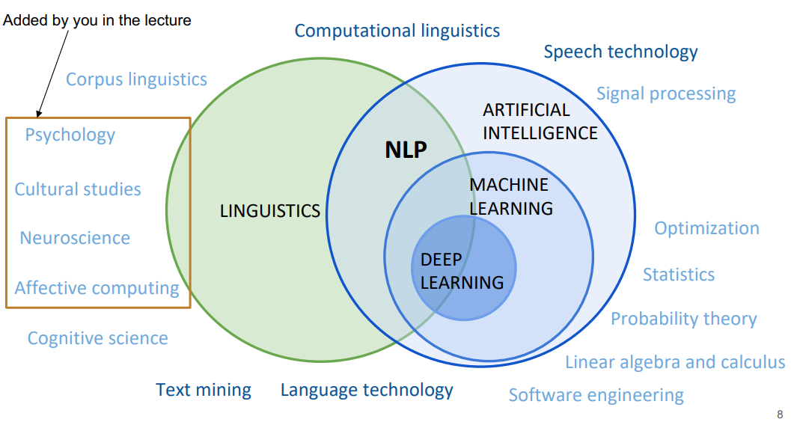
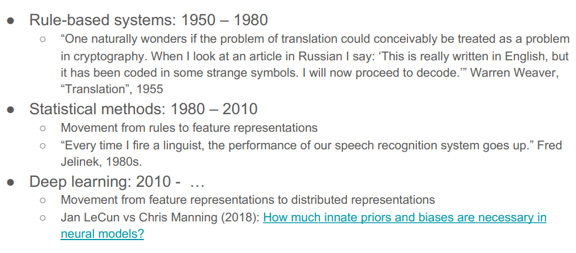
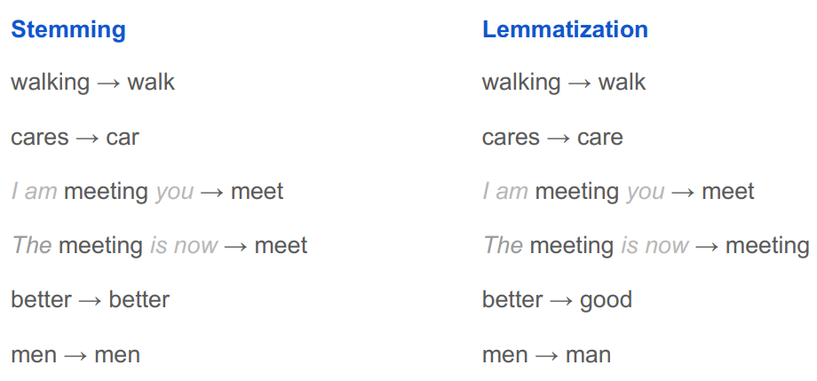
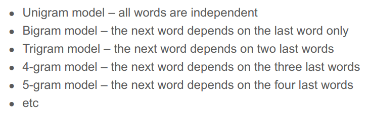
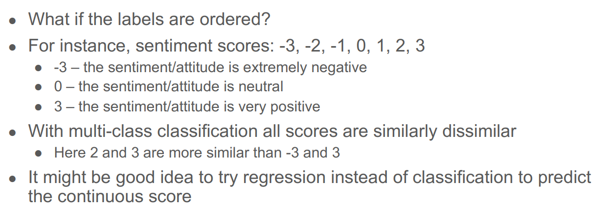
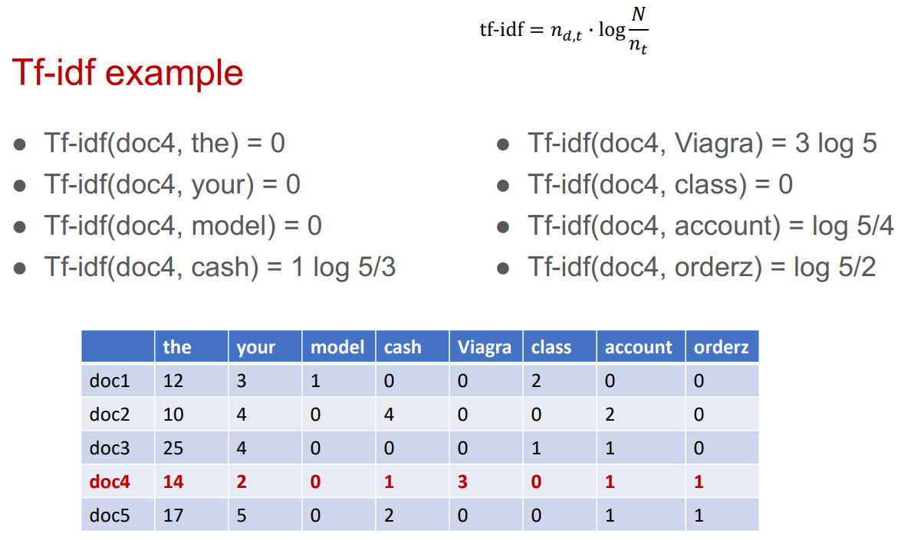
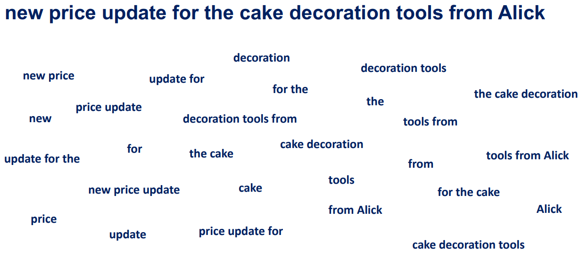
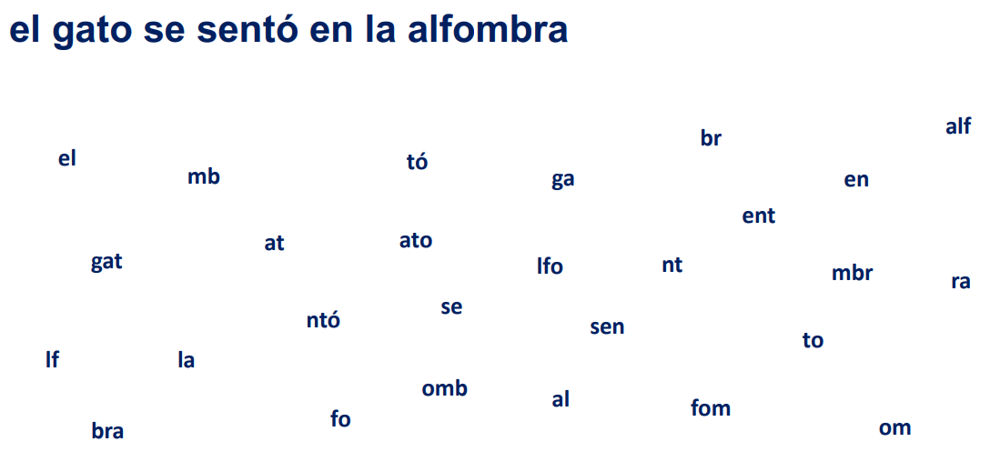
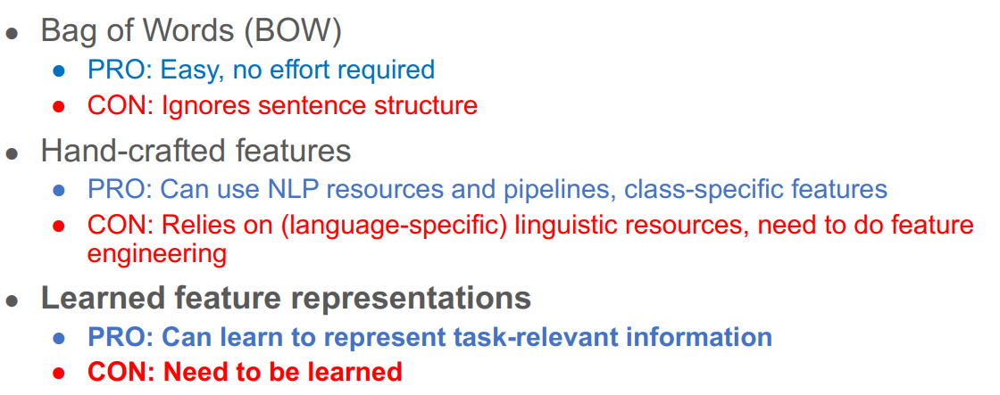
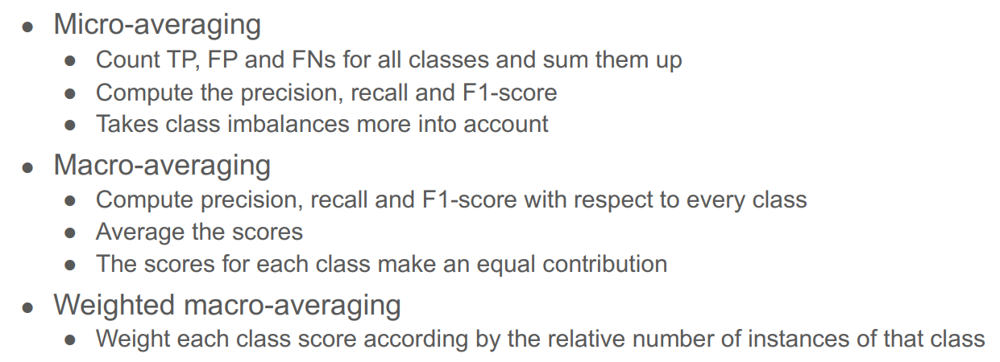

# Day 8 - UT NLP 2021

https://courses.cs.ut.ee/2021/NLP/spring/Main/Lectures

## Introduction to NLP

- 
- Brief History
  
- Text corpora and NLP datasets
  - text corpus = collection of texts
  - text corpus + annotation or labels = dataset
    - annotation can be: categories, named entities, sentiment, translation, summary, answer to question
- Stemming and Lematization
  
- Preprocessing
  - goal -> transforming the text into a format that can be fed into an NLP system
  - can be:
    - Segmentation, tokenization
    - Lowercasing the text
    - Stemming / Lematization
    - Remove stopwords
    - Normalization
    - Noise Removal: punctuation, special characters, urls, hashtags etc
  - Is it necessary?
    - It depends ..
    - Neural models need less preprocessing than statistical models (like SVM)
    - Stop-word removal is not a good idea if the word ordering is important in the model

## Language Modeling

- Two main purposes:
  - Estimate the grammaticality or fluency of a sentence or text in order to pick one of several possible options
  - Generate fluent and grammatical sentence or text
- N-gram language model
  
- Software for language modelling
  - KenLM: https://github.com/kpu/kenlm 
  - SRILM: http://www.speech.sri.com/projects/srilm/

## Text Classification

- Classification vs Regression
  

- Text representation for classification

  - TF-IDF

    - Tf-idf = tf (term frequency) x idf (inverse document frequency)
    - Example:
      
    - Pre-processing:
      - Tokenization
      - Stemming/Lemmatization
      - Remove stop words
      - Remove infrequent words
      - Replace certain word tokens with special entities
      - Replace all numeric tokens with NUM
      - Lowercase the text
      - Social media - handle emoticons

  - BOW (Bag of Words)

    - Variation
      word n-grams
      

      character n-grams
      

- How to represent a document?
  

- Default baselines for text classification

  - Logistic regression or SVM for binary classification
  - Logistic regression for multiclass classification
  - Fasttext classification model
  - When the dataset is small, it also makes sense to try Naive Bayes
  - Logistic regression, SVM and Naive Bayes are available in sklearn

- Evaluating Measure

  - Accuracy: not suitable when the classes are unbalanced
  - Precision: also called positive predictive value
  - Recall: also called true positive rate or sensitivity
  - F1-score: combines precision and recall

- Micro- and macro-averaging
  

